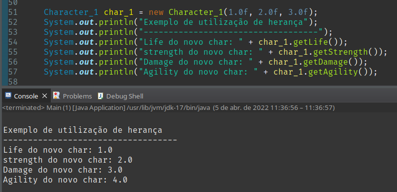
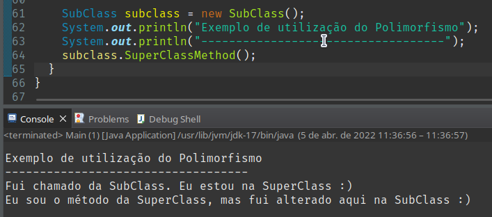
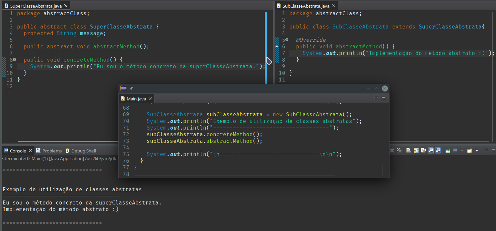
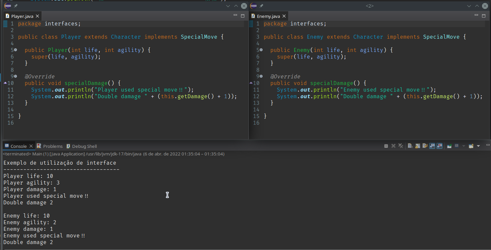

# Aceleração Java

### Ao rodar a classe 'while' do pacote 'ConditionalsAndRepetitions' teremos o seguinte resultado

### Ao rodar a classe 'for'  do pacote 'ConditionalsAndRepetitions' teremos o seguinte resultado

### Ao utilizar a classe 'Livro' do pacote 'JavaClasses' teremos o seguinte resultado

### Adicionado aos exemplos o pacote inheritance_1 com duas classes para exemplificar a utilização de herança
Abaixo a imagem com uma parte do código e seu respectivo retorno

### Adição de um exemplo de polimorfismo do pacote polymorphism
Abaixo a imagem com uma parte do código e seu respectivo retorno

### Implementação de uma classe abstrata
Abaixo a imagem com a superClasse, subClasse e o arquivo main chamando os métodos pela subClasse

### Implementação de interface
abaixo a imagem com os dois objetos criados utilizando os conceitos de herança e interface

