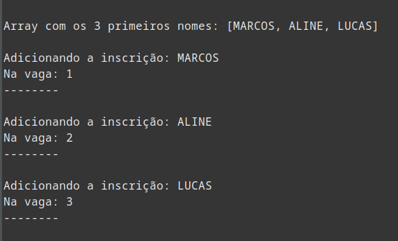
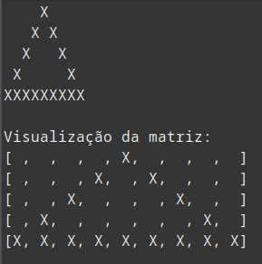
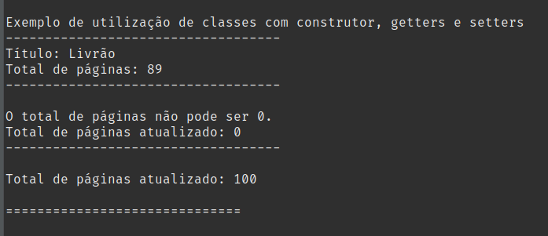

# Aceleração Java

### Ao rodar a classe 'while' do pacote 'ConditionalsAndRepetitions' teremos o seguinte resultado

### Ao rodar a classe 'for'  do pacote 'ConditionalsAndRepetitions' teremos o seguinte resultado

### Ao utilizar a classe 'Livro' do pacote 'JavaClasses' teremos o seguinte resultado

### Adicionado aos exemplos o pacote inheritance_1 com duas classes para exemplificar a utilização de herança.
